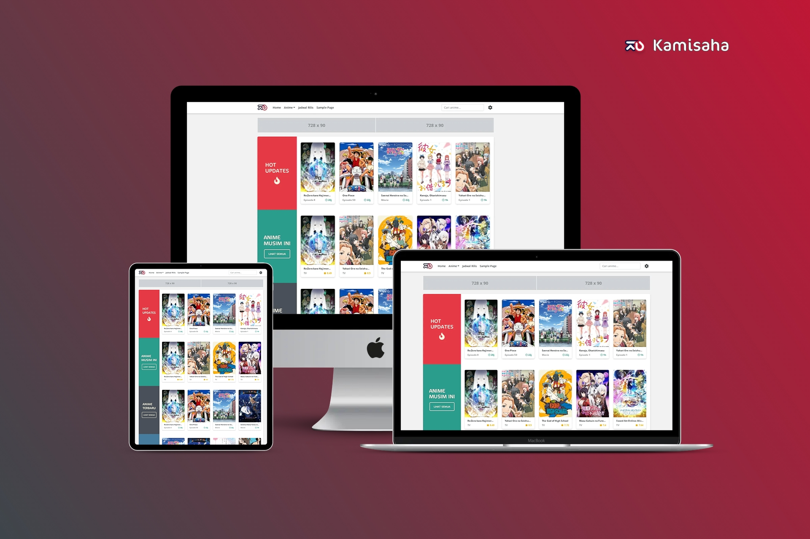

# Getting Started

Selamat datang di website dokumentasi Kamisaha. Bagi kalian yang tidak tahu apa itu, pada dasarnya Kamisaha adalah Theme Wordpress yang dibuat khusus untuk streaming dan download Anime.

Theme Kamisaha mengusung konsep Minimalist dengan sedikit dibumbui elemen moe, memiliki fungsionalitas yang tinggi dan juga sederhana membuat theme Kamisaha ini menjadi theme terbaik untuk streaming anime _(menurut saya pribadi)_.

#### Fitur-fitur yang ada di Kamisaha

1. SEO Friendly
2. Fully Responsive / Mobile Friendly
3. Ter-integrasi Myanimelist Grabber / Jikan API
5. Tersedia halaman setting yang memudahkan kustomisasi Theme
3. Post anime super gampang, semuanya di dalam satu halaman dan menggunakan shortcode
3. Menampilkan anime nya pakai sistem Cour
3. Tersedia juga halaman Blog, dan bisa di aktif atau nonaktifkan dengan bebas
3. Bisa memasang komentar di halaman depan
3. Live search menggunakan Ajax
3. Bisa mencari judul anime dengan mudah
3. Menu Navigasi Sticky
4. Navigasi halaman dengan mode load more
5. Smooth Scroll
6. dll.