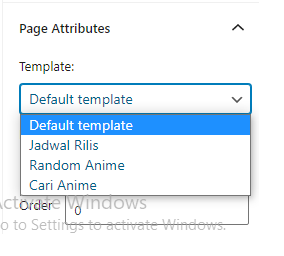

# How to create Search Advanced / Schedule / Random page

The steps are the same as for create Page in general, just create Page and then title it Search Advanced / Schedule / Random.

Next on Page Attributes choose the template, match it with the page title.

After that click publish, no need to write anything on the content.

Done!

For Schedule page, you can setting the anime at **Theme Setting**.