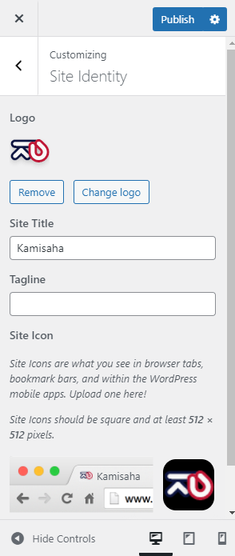
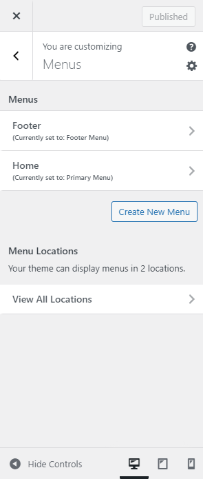
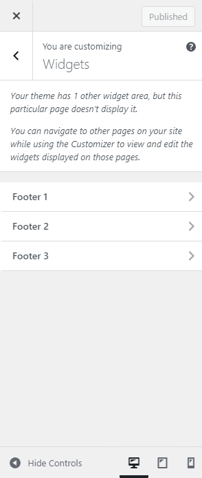
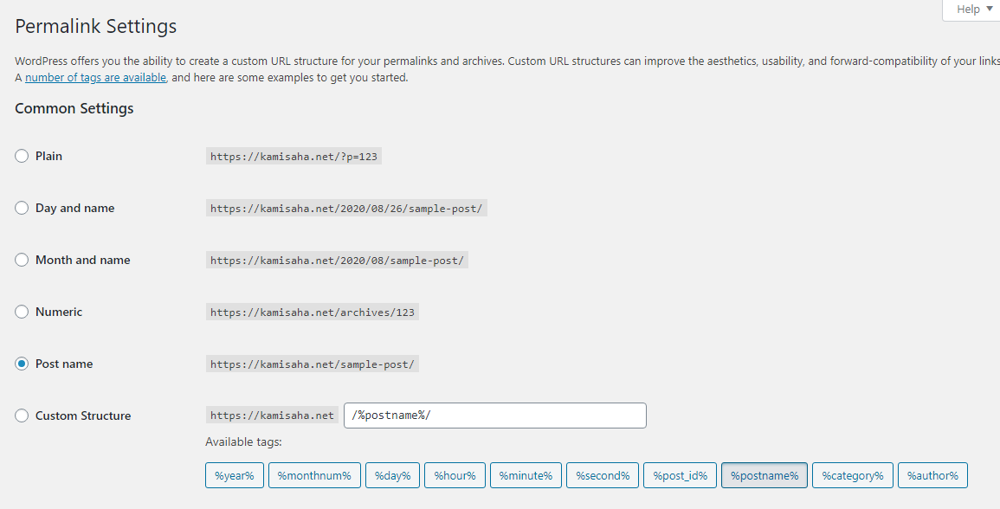

# Customization

## Site Identity

There's Logo you can change here, but this only change in the **Light Mode** version of theme. To change logo in the **Dark Mode** version, you can go to General > Dark Mode

## Menus

There's only 2 menu, Footer and Home menu.

> Important note: In Kamisaha V2.16 the Footer Menu is deprecated and removed. Instead, we change it with Widget Footer.

## Widget

There's 3 Footer Widgets, and one Sidebar Widget. To see the Sidebar Widget, you should go to the Blog page first.

This also doesn't need to be changed.

## Media

This too.

## Permalinks

You can set permalink whatever you want, but I personally prefer the simple one so it'll be Post name.

*And it is recommended to at least once press the Save Changes button so that there are no 404 pages*

## Privacy

For privacy.