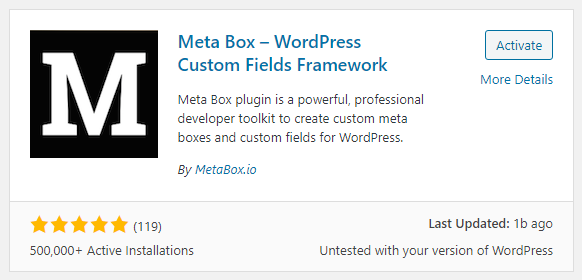
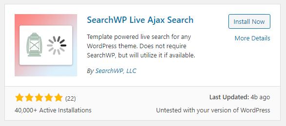

# Install Plugin

There are only 2 plugins that must be installed, and both plugins can be found and installed directly in the WordPress Admin. Or you can also install plugins manually, I have provided the plugins in the Plugin folder.

### 1. Meta Box

The most required plugin.

### 2. SearchWP Live Ajax Search

Actually, this doesn't really matter, if you don't want Live Search. But if you want the search feature to be live or you don't need to press enter the search results come out right away, then this plugin must be installed.