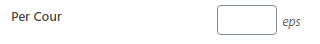

# How to post anime

#### Click sidebar Anime > Add anime

##### 1. If you don't want to bother filling in anime information, you can do it automatically by entering Myanimelist ID in the box provided.

Click Generate, and the anime information will be filled automatically.

##### 2. Sistem **Cour** 

Here is the interesting part, in single page you can freely display how many episodes you want. I named it **Cour**.

Example :

If you fill the Cour with 12 episodes, then on one page there will appear 12 episodes. And the 12 episodes fall into the **Cour 1** category, so episodes more than 12 will fall into the **Cour 2** category. And so on.

Cour 1 = 1 - 12 Episode

Cour 2 = 13 - 24 Episode

Cour 3 = 25 - 36 Episode

And so on...

That's what will happen if you fill in Cour with 12 episodes, then 1 cour is a multiple of 12.

**And if you don't fill in Cour, it will take from the anime's Total Episode data.**

 You didn't fill in Cour.

Then at one page will display the episodes according to the total episodes of the anime.

In the example above, the total episodes are 25. Then the anime in 1 Cour / page will display 25 episodes.

However, if the Total Episode is also empty (*if it's empty it's usually an ongoing anime*), and you don't fill in the Cour, then the Default is 14.

##### 3. Episode Anime

Explanation :

**Episode** : Fill with numbers (required)

**Source** : Fill with a group name that subbed the anime, or you can just simply ignore it and it will show your website name.

**Release Date** : Release date, ignore this shit

**Resolution** : It's up to you.

**Mirror Stream** : Fill the name field with Player Name, and URL field with embedded URL video. You can also press Add mirror button to add more mirror

**Download Box** : The resolution one is actually you can fill it with anything, it doesn't have to be 1080p, you can fill it with like HD or SD

**IS this the end?** : The checkbox if the particular episode on particular anime is the last episode

##### 4. Batch

It's the same like Download box.

