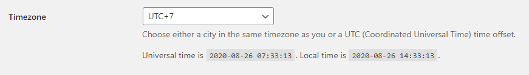

# Settings

## General

In the Settings > General section, don't forget to set Timezone to UTC + 7 or whatever matches your current location.

## Writing

Nothing needs to be changed.

## Reading

If the Homepage Displays has been changed, there is no need to change anything else. Unless the show post you can fill with anything you want.

## Discussion

This also doesn't need to be changed.

## Media

This too.

## Permalinks

You can set permalink whatever you want, but I personally prefer the simple one so it'll be Post name.

*And it is recommended to at least once press the Save Changes button so that there are no 404 pages*

## Privacy

For privacy.