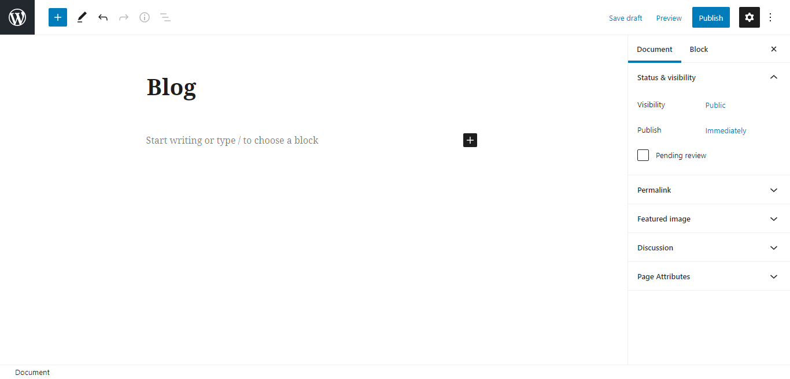
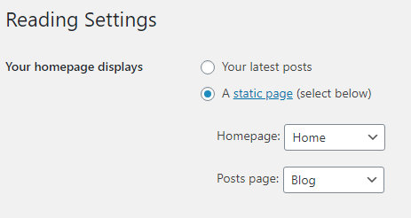
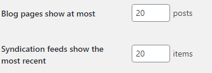

# Setting Static Page

##### 1. Create a new page

Give the new page title Home, then click Publish.

Do something similar, but this time give the title of the page Blog. Then click Publish.

##### 2. Setting static page

Go to Settings > Reading, in the section *Your Homepage Displays* change to A static page then fill in the Homepage with Home and Posts Page with Blog.

Finally, click the Save Changes button and voila! The front page changed

##### Addition

The one above is to show how many anime are on https: // {namaweb} .com / anime, not posts. It is recommended 20/30 but it's up to you how much. 